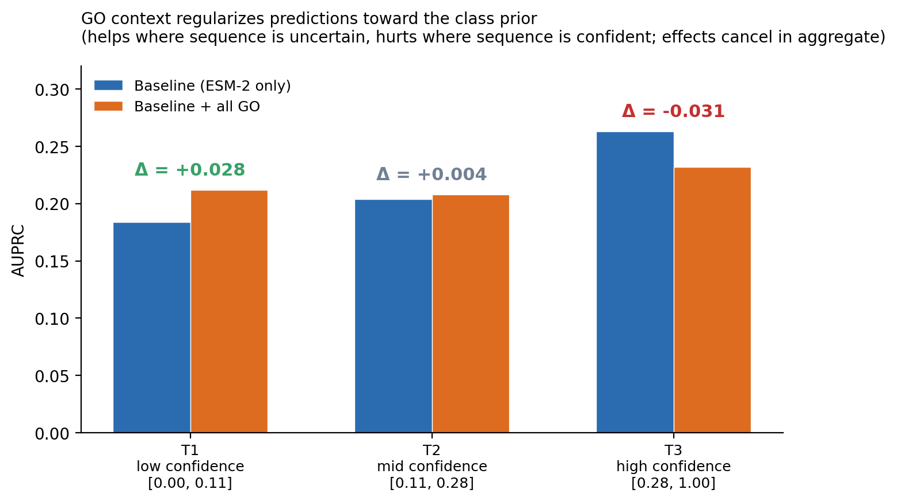
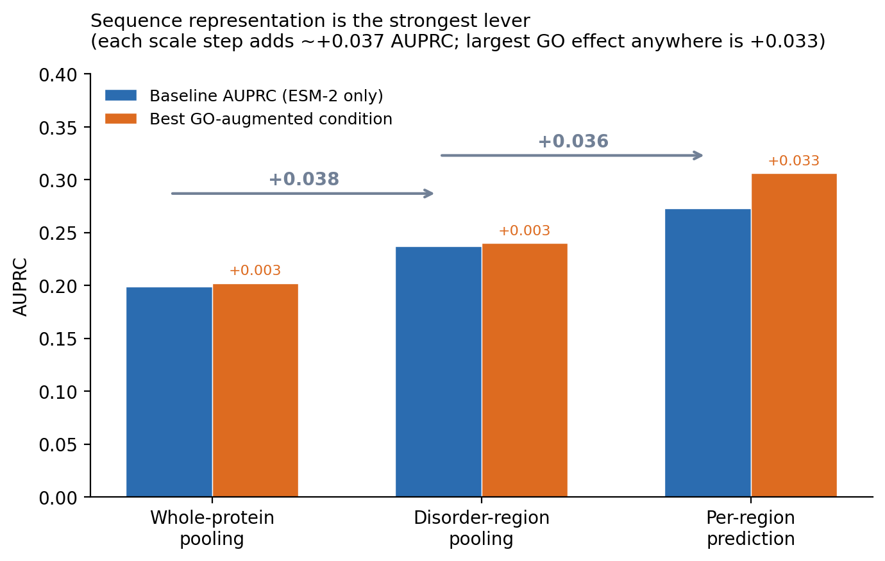

# 3. Results

## 3.1 Dataset and primary factorial

The dataset covered 1,279 non-redundant human proteins (188 d2o-positives at 14.7% prevalence) grouped into 967 CD-HIT clusters at 40% identity. The region-level extension covered 3,231 regions (391 positives at 12.1% prevalence).

I ran the 2×2×2 GO factorial at the disorder-pool ESM-2 scale first. Table 1 gives the full result.

**Table 1** — Disorder-pool factorial. AUPRC ± fold SD, BH-adjusted p-values from paired one-sided Wilcoxon against baseline.

| Condition | AUPRC | Δ vs baseline | BH-adj p |
|---|---|---|---|
| C0 baseline | 0.237 ± 0.062 | — | — |
| C1 +BP | 0.238 ± 0.062 | +0.001 | 0.94 |
| C2 +MF | 0.236 ± 0.062 | −0.001 | 0.94 |
| C3 +CC | 0.239 ± 0.062 | +0.002 | 0.94 |
| C4 +BP+MF | 0.238 ± 0.062 | +0.001 | 0.94 |
| C5 +BP+CC | 0.240 ± 0.062 | +0.003 | 0.94 |
| C6 +MF+CC | 0.238 ± 0.062 | +0.001 | 0.94 |
| C7 full | 0.239 ± 0.062 | +0.002 | 0.94 |

No condition's lift exceeds the fold-noise floor of about 0.010, and no BH-adjusted p-value approaches significance. This looks like a flat null, but the interesting question is *why* it is null. §§3.2 and 3.3 answer it.

## 3.2 PLMs already contain GO Slim's discriminative content

If GO Slim carried no information relevant to d2o prediction, we would expect the model to ignore GO features. It does not. Permutation importance in the C7 joint model splits **99.7% to ESM-2 dimensions and 0.3% to the 118 GO Slim features** (Figure 1a). The per-feature importance ratio is roughly 46,000 to 1 in favor of ESM-2, so GO is not being ignored, it is being outcompeted.

The small fraction of GO importance that exists concentrates on **biologically correct terms** (Figure 1b, top-15). RNA binding and DNA binding lead; regulation of transcription, DNA-binding transcription factor activity, kinase activity, and the nuclear and cytosolic compartments follow. These are the categories one would predict a priori for coupled folding-and-binding proteins, since roughly half of DisProt's d2o-positives are transcription factors, transcriptional coactivators, or RNA-binding proteins. So the classifier is finding the biologically right GO features. It just cannot extract enough additional information from them to move AUPRC beyond fold noise.

The parsimonious reading is that ESM-2's pretraining on approximately 250 million UniRef sequences (Lin et al., 2023; Rives et al., 2021) has already learned the sequence signatures characteristic of these functional categories. RNA-binding proteins have distinctive composition biases in their disordered regions (Chong et al., 2018); transcription factors share short linear motifs at defined register positions (Van Roey et al., 2014); kinases share catalytic-triad neighborhoods. A PLM trained at that scale would learn these signatures unsupervised. GO Slim's "RNA binding" is a categorical label; ESM-2's embedding is a continuous representation of the sequence features that make a protein an RNA-binding protein in the first place.

## 3.3 GO context acts as a regularizer toward the class prior (H4 partial support)

Stratified analysis of H4 revealed structure that the flat AUPRC pool hides (Figure 2). I binned proteins into low, mid, and high tertiles by the baseline classifier's predicted probability and recomputed AUPRC within each tertile for C0 and C7.

**Table 2** — GO lift stratified by baseline confidence tertile (disorder-pool scale).

| Tertile | Baseline probability | Baseline AUPRC | +GO AUPRC | Δ |
|---|---|---|---|---|
| T1 low | [0.00, 0.11] | 0.184 | 0.212 | **+0.028** |
| T2 mid | [0.11, 0.28] | 0.204 | 0.208 | +0.004 |
| T3 high | [0.28, 1.00] | 0.263 | 0.232 | **−0.031** |
| Pooled | — | 0.199 | 0.199 | 0.000 |

GO context helps in the low-confidence tertile (+0.028) and hurts in the high-confidence tertile (−0.031). The two cancel in the pool. The clean reading: GO features act as a Bayesian-like regularizer toward the class prior. When ESM-2 is uncertain, GO features nudge predictions in the direction the top-ranked biological terms point (correct on average). When ESM-2 is confident, the categorical GO signal drags predictions back toward the population mean because it cannot distinguish the specific protein from the class it belongs to. H4 predicted the low-confidence lift; the symmetric high-confidence loss was not pre-registered but fits the same mechanism.

## 3.4 Sequence representation is the strongest lever

The three prediction scales give the study's practical finding for method developers.

**Table 3** — Baseline (ESM-2 only) AUPRC at three prediction scales.

| Scale | Feature aggregation | Baseline AUPRC | Δ vs previous |
|---|---|---|---|
| Whole-protein | Mean-pool over full sequence | 0.199 | — |
| Disorder-pool | Mean-pool over DisProt-annotated residues | 0.237 | **+0.038** |
| Region-level | Mean-pool per disordered region (3,231 rows) | 0.273 | **+0.036** |

Each scale-refinement step adds about +0.037. The largest GO effect observed anywhere in the study is +0.033 (region-scale, C7 vs baseline), smaller than a single scale step (Figure 3). For method developers building d2o predictors on modern PLMs, this is the practical lesson: engineering sequence representation and prediction scale returns more than integrating richer auxiliary annotations.

## 3.5 Higher-resolution GO does not rescue the null

If ESM-2 had only absorbed the *coarse* content of GO Slim, a finer representation might still add value. I built a full-term GO matrix per sub-ontology by taking each protein's experimental annotations, walking each up the ontology to include all ancestors, and encoding the result as a multi-hot vector. This produced 1,950 BP terms, 618 MF terms, and 329 CC terms, an order of magnitude finer than Slim.

The BP main effect at this resolution gave an initial +0.016 AUPRC lift. This looked worth writing up, so I ran four pre-registered strengthening checks (Figure 4).

**Table 4** — Strengthening pass on the BP full-term effect.

| Check | Result | Interpretation |
|---|---|---|
| Bootstrap 95% CI on fold diffs | [−0.008, +0.054] | Crosses zero |
| Scrambled-BP control | +0.009 vs +0.016 real | 55% is dimensionality-driven |
| Top-20 BP features | Generic ancestor terms | No IDP-mechanism specificity |
| Stability across 9 seed combos | Mean +0.009, range [+0.003, +0.016] | Original +0.016 was a lucky seed |

The apparent +0.016 was fold-1-driven with a bootstrap CI that includes zero. A scrambled-annotation control that randomly reassigns BP annotations across proteins reproduced +0.009 of the +0.016, showing that most of the effect is Random Forest exploiting the extra 1,950 binary features to hedge better rather than extracting real BP signal. The top-20 BP features at full-term resolution are ancestor-inherited generic terms (regulation of primary metabolic process, positive regulation of biological process, response to stimulus) rather than IDP-mechanism-specific terms. Stability across 9 (RF seed × CV seed) combinations gave a mean lift of +0.009 that matches the scrambled control almost exactly. The finding does not survive strengthening. **The mechanistic story in §3.2 therefore generalizes to at least two levels of GO resolution.**

## 3.6 Robustness across classifier, PLM family, and region scale

**Classifier.** Repeating the disorder-pool factorial with XGBoost (Chen and Guestrin, 2016) gave baseline AUPRC 0.243 and non-baseline lifts in [−0.002, +0.005], none significant after BH. The 99.7%/0.3% importance split from §3.2 was preserved (99.4%/0.6% under XGBoost).

**PLM family.** Repeating with ProstT5 (Heinzinger et al., 2023) in place of ESM-2 gave baseline AUPRC 0.229 and maximum condition lift +0.006 at C7, again null after BH (full table in Appendix E).

**Region scale.** The region-level factorial mostly reproduces the protein-scale null. The exception worth noting: at region scale the CC main effect is +0.019 (BH-adj p = 0.14) and the BP×CC interaction is +0.033 (BH-adj p = 0.09). Neither survives multiple-comparison correction, but both are the largest GO effects observed. The plausible reading is that at protein scale, CC is constant within a protein and contributes zero variance; at region scale, the model can pair per-region sequence features with the protein's shared CC context. I flag this as a directional hint, not a confirmed finding.
